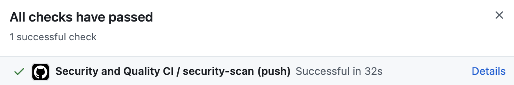
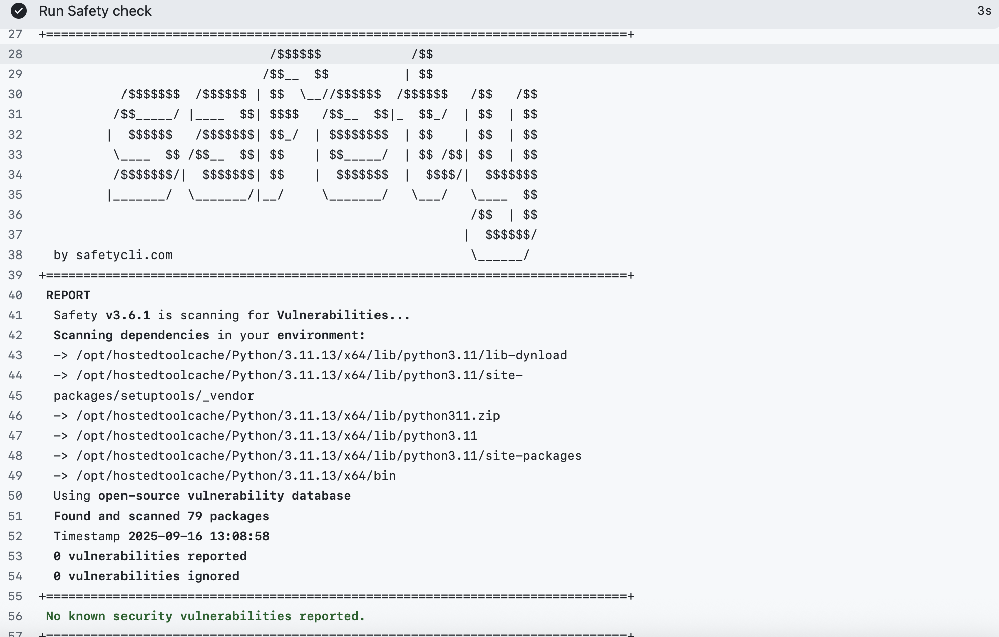
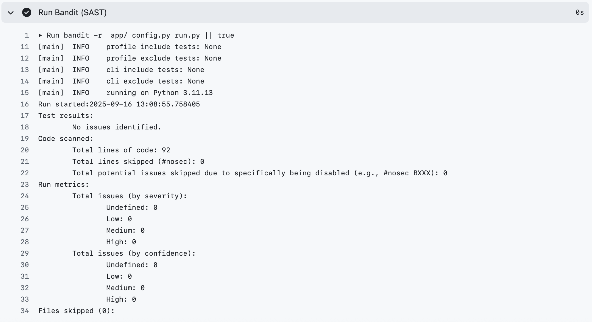

# Отчет по лабораторной работе 1: Разработка защищенного REST API с интеграцией в CI/CD

### Описание проекта
Разработка безопасного backend-приложения с аутентификацией JWT и интеграцией security-сканирования в CI/CD pipeline.

### Эндпоинты API

#### Аутентификация
- **POST /auth/login** - Аутентификация пользователя
  ```bash
  curl -X POST http://127.0.0.1:5000/auth/login \
    -H "Content-Type: application/json" \
    -d '{"username":"test","password":"test"}'
  ```
  *Возвращает JWT токен*

#### Защищенные эндпоинты (требуют JWT)
- **GET /api/data** - Получение данных пользователя
  ```bash
  curl -X GET http://127.0.0.1:5000/api/data \
    -H "Authorization: Bearer <JWT_TOKEN>" \
    -H "Content-Type: application/json" 
  ```

- **POST /api/posts** - Создание нового поста
  ```bash
  curl -X POST http://127.0.0.1:5000/api/posts \
    -H "Authorization: Bearer <JWT_TOKEN>" \
    -H "Content-Type: application/json" \
    -d '{"title":"Мой пост","content":"Содержание"}'
  ```

### Реализованные мер защиты

#### Защита от SQL Injection (SQLi)
- **Технология:** SQLAlchemy ORM
- **Реализация:** Использование параметризованных запросов через ORM
- **Код:**
  ```python
  user = User.query.filter_by(username=username).first()
  ```

#### Защита от XSS (Cross-Site Scripting)
- **Технология:** MarkupSafe.escape()
- **Реализация:** Экранирование всех пользовательских данных перед выводом
- **Код:**
  ```python
    return (
        jsonify(
            {
                "user_id": user.id,
                "username": escape(user.username),
                "message": "Добро пожаловать в защищенное API!",
            }
        ),
        200,
    )
  
    return (
        jsonify(
            {"msg": "Пост создан", "title": escape(title), "content": escape(content)}
        ),
        201,
    )
  ```

#### Аутентификация
- **Технология:** JWT + bcrypt
- **Реализация:**
  - **Хэширование паролей:** bcrypt с солью
  ```python
    def set_password(self, password):
        self.password_hash = hashpw(password.encode("utf-8"), gensalt()).decode("utf-8")
  
    def check_password(self, password):
        return checkpw(password.encode("utf-8"), self.password_hash.encode("utf-8"))
  ```
  - **JWT токены:** Stateless-аутентификация
  ```python
    access_token = create_access_token(identity=str(user.id))
  ```
  - **Middleware проверка:** @jwt_required() на защищенных эндпоинтах

### CI/CD Pipeline и результаты проверок


*Успешное выполнение CI/CD pipeline*


*Отчет Safety - 0 уязвимостей в зависимостях*


*Отчет Bandit - 0 уязвимостей в коде*
